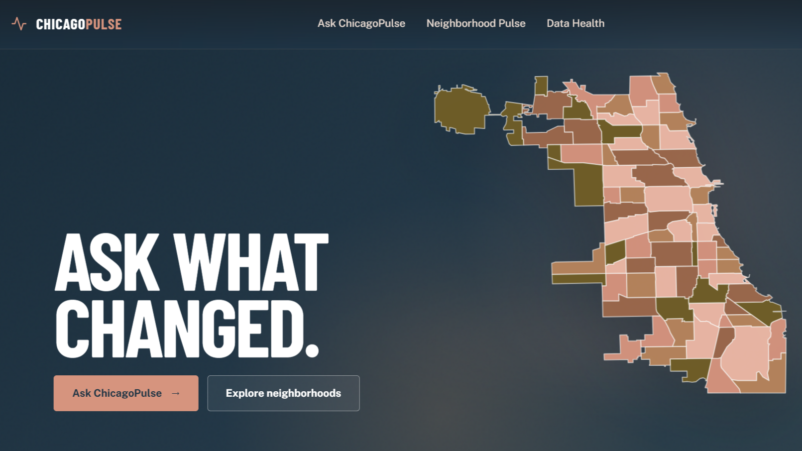

<div align="center">

# ChicagoPulse

**Ask Chicago a question. See the neighborhood evidence behind the answer.**



ChicagoPulse turns governed City of Chicago open data into plain-language
answers, neighborhood comparisons, maps, and transparent operational health
signals. It is powered by Databricks Genie and built for residents, community
organizations, civic-data practitioners, and anyone who wants local context
without wrestling with raw datasets.

[**Open ChicagoPulse**](https://chicagopulse-7474647819672339.aws.databricksapps.com)

> ChicagoPulse runs as a Databricks App. Access to the live experience may
> require permission in the connected Databricks account.

</div>

## One city, three ways to explore

### Ask ChicagoPulse

Ask natural-language questions about 311 service requests, business licenses,
building permits, and building violations. ChicagoPulse keeps the conversation
grounded in the configured Genie Space and lets you inspect:

- concise written answers and suggested follow-up questions;
- automatic charts with a table fallback;
- generated SQL and request provenance;
- the live Genie Agent identity and active conversation link; and
- answer feedback that maintainers can use to improve verified instructions and
  SQL examples.

### Neighborhood Pulse

Move from a citywide view to one of Chicago's 77 official Community Areas.
Search the city, select areas directly from the choropleth, compare up to four
neighborhoods, and explore:

- completed-month metrics with month-over-month context;
- 12-month 311 trends and top service-request types;
- business-license, permit, and violation activity; and
- explicit `N/A` states when a source is unavailable, never a misleading zero.

### Data Health

See why the data should be trusted before using it. Data Health separates
end-to-end pipeline success from source-ingestion freshness and includes:

- the last successful refresh and latest completed reporting month;
- coverage, row counts, ingestion timestamps, and official Socrata links;
- a source catalog that distinguishes datasets used by ChicagoPulse from
  potential future sources; and
- an inline, confirmed pipeline runner with real Databricks task states and a
  direct link to the run.

## The data behind ChicagoPulse

ChicagoPulse currently models four official City of Chicago datasets:

| In ChicagoPulse | City dataset |
| --- | --- |
| Service demand | [311 Service Requests](https://data.cityofchicago.org/d/v6vf-nfxy) |
| Business activity | [Business Licenses](https://data.cityofchicago.org/d/r5kz-chrr) |
| Development activity | [Building Permits](https://data.cityofchicago.org/d/ydr8-5enu) |
| Property conditions | [Building Violations](https://data.cityofchicago.org/d/22u3-xenr) |

The Data Health catalog also identifies official datasets being considered for
future scope, including food inspections, crimes, traffic crashes, and
affordable rental housing developments. These sources are clearly marked and
are not currently ingested or available to Genie.

## Built for verifiable answers

ChicagoPulse is designed to make evidence visible:

- Genie answers come from governed Unity Catalog Metric Views.
- Data queries use allowlisted, parameterized server-side templates. The browser
  cannot submit arbitrary SQL.
- Generated SQL, source IDs, and request provenance remain inspectable.
- Only fully completed calendar months appear in neighborhood metrics.
- Pipeline health comes from authoritative run-state and validation records,
  not merely the latest ingestion timestamp.
- Markdown is sanitized before rendering, API errors are normalized, and no
  resource credentials are exposed to the browser.

## How it works

```text
React + TypeScript app
        |
        | same-origin /api/*
        v
FastAPI normalization layer
        |-- Genie Conversation and Feedback APIs
        |-- SQL Warehouse with allowlisted queries
        `-- Jobs API for the bound daily refresh
                         |
                         v
             workspace.chicagopulse
```

The frontend and API run together as a Databricks App using its dedicated
service principal and explicit resource bindings. Mock providers reproduce the
core chat, data, and pipeline lifecycles for safe local development.

## Project status

The production snapshot is live on Databricks Apps Free Edition. The current
application includes the Chicago-at-dusk responsive interface, centered desktop
navigation, mobile bottom navigation, a global footer, answer feedback, the
task-level pipeline visualization, and the expanded Data Health source catalog.

## Contributing and running locally

Installation, environment variables, mock and authenticated local modes,
validation commands, deployment steps, and troubleshooting now live in
[SETUP.md](SETUP.md).

The data pipeline in `notebooks/` and Genie assets in `genie/` are maintained as
separate governed surfaces. Review [AGENTS.md](AGENTS.md) before making changes.

## Responsible use

ChicagoPulse summarizes public administrative data for neighborhood-level
exploration. It is not real-time, address-level, emergency, legal, or policy
decision support. Source records can be revised by the City of Chicago, so use
the linked datasets and Data Health evidence when decisions require additional
verification.
